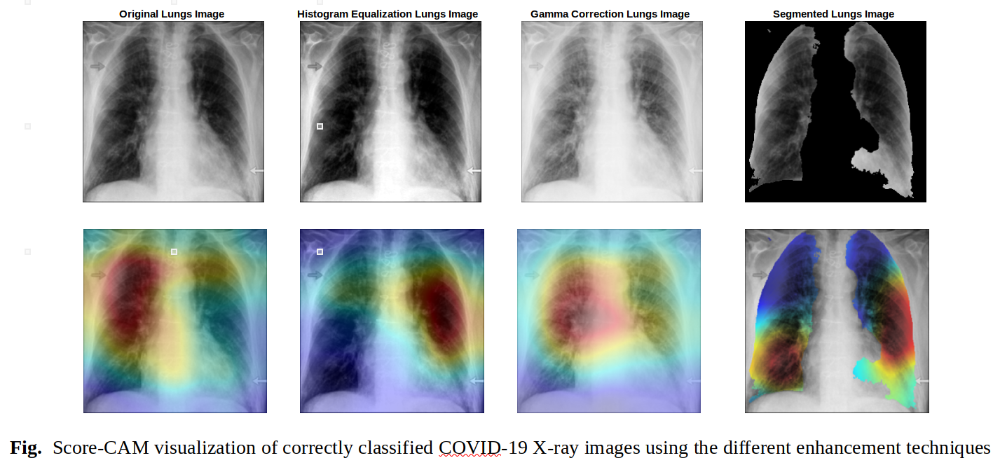

# COVID-19 Chest X-Ray Classification

COVID-19 Chest X-Ray Classification is a project that aims to classify Chest X-Ray Images into 3 classes: COVID-19, Pneumonia and Normal. The dataset used for this project is [COVID-19 Radiography Database](https://www.kaggle.com/tawsifurrahman/covid19-radiography-database) from Kaggle. The project was build using ResNet-18 architecture and trained using MATLAB. Moreover the project present the idea of using U-Net to segment the infected area in the X-Ray images.

This project was final class project for the Computer Aided Engineering course offered by National Cheng Kung University and that was taught by Professor [Chih-Han Chang](https://researchoutput.ncku.edu.tw/en/persons/chih-han-chang)

## Code

The repository consist of 4 main files, which are: Demonstration Code, Image Processing Code, Training Network Code, and Unet. The Demonstration Code is used to demonstrate the result of the experiment. The Image Processing Code is used to pre-process the image. The Training Network Code is used to train the network. The Unet is used to segment the infected area in the X-Ray image. Each of the code has its own comment to explain the code.

## Dataset

The Kaggle Dataset consist of three different labels, which are: Normal, Pneumonia, and COVID-19. This project only utilize 1210 images from each class for the training and validation process. The images are in PNG format and have different sizes. The images are also not in the same orientation.Therefore pre-processing the image is a must to have good result.

## Download Model and Program

Since the trained model and program(.exe) is too big to be uploaded to GitHub, they are uploaded to Google Drive. The link to download the model and program is [here](https://drive.google.com/drive/u/0/folders/1szrQKjXc2WnznMlah3nj8PUNoXRzYUB6). The model are as follows: `ResNet18_Gamma`, `ResNet18_Histogram`, `ResNet18_Segmented`, and `ResNet18_Original`. The program is called `CAE_LungsClassification.exe` and it is a Windows executable file. The program is a GUI program that allows user to select an image and classify it. The program will then show the result of the classification and the visualization of the classification.

## Experiment

The experiment was conducted using MATLAB 2020a. The ResNet-18 architecture was used as the base model. The main objective of the experiment is to compared which image processing techniques give the best result. The image processing techniques that were used are: Histogram Equalization, Gamma Correction, and Lung Segmentation. All of them were compared with base result which is the original image. The experiment was conducted using 10-fold cross validation. The result of the experiment is shown in the table below.

| Image Processing Technique | Accuracy | Sensitivity | Specificity |
| -------------------------- | -------- | ----------- | ----------- |
| Original                   | 97.86    | 97.86       | 98.93       |
| Histogram Equalization     | 97.76    | 97.76       | 98.88       |
| Gamma Correction           | 97.60    | 97.60       | 98.60       |
| Lung Segmentation          | 97.64    | 97.64       | 98.88       |

From the figure, Score-Cam visualization tells us that the model is focusing on the infected area. The model is also focusing on the area that is not infected. This is because the model is trained using the whole image. Therefore, the model is not able to differentiate between the infected area and the non-infected area. This is where the idea of using U-Net to segment the infected area comes from.
